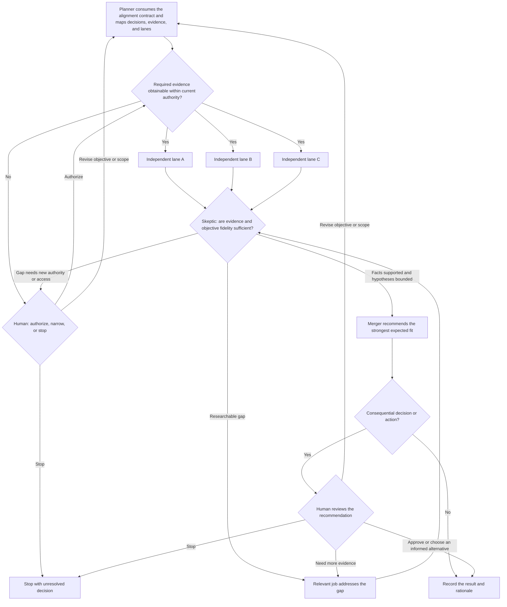

# Graph Engineering

Engineer the graph. Do not run it.

Design the work around AI instead of relying on one giant chat.

## Design-only boundary

The sole deliverable of this skill is an approval-ready graph. This boundary applies in every mode, including Plan Mode.

Treat verbs such as *determine*, *research*, *validate*, *build*, or *implement* as the outcome the future graph must produce—not as permission to perform that work now.

While designing:

- inspect the user's context only enough to understand the objective, constraints, and consequential decisions;
- ask only questions whose answers could materially change the graph;
- identify the evidence and access needed to resolve those decisions;
- turn researchable unknowns into jobs inside the graph;
- place a human gate before any future evidence method that needs new authority;
- do not browse or investigate those unknowns;
- do not launch workers, subagents, skeptics, or mergers;
- do not execute any graph job or produce the graph's terminal deliverable; and
- do not modify the target project or external systems.

Stop after presenting the graph for human approval. The displayed nodes are future jobs. Execution begins only after the user has seen and approved the graph, and it happens outside this skill.

## Align before engineering

Begin every invocation with an adaptive alignment interview.

First inspect the conversation, supplied artifacts, current authoritative context, and previously settled decisions. Do not ask the user for information that is already available and current.

Resolve every material ambiguity about:

- the objective and why it matters;
- the expected terminal result;
- what success and failure mean;
- what the result should optimize for;
- priorities, non-negotiables, and unacceptable tradeoffs;
- scope and non-goals;
- authoritative versus stale context;
- constraints involving evidence, access, authority, time, or cost;
- decisions the graph may make; and
- decisions that belong to the human.

Ask one material question at a time and follow each answer only as far as it can change the objective, success criteria, scope, decision criteria, research lanes, graph topology, evidence methods, or human gates. Ask each question with the `AskUserQuestion` tool, not plain chat text. If material ambiguity remains after an answer, ask again rather than guessing. A complete brief may need only confirmation; an ambiguous objective may require a longer interview.

Separate unknowns into:

- **user-intent unknowns**, which the interview must resolve;
- **discoverable context**, which should be inspected rather than asked;
- **researchable unknowns**, which become jobs inside the future graph; and
- **authority-bound unknowns**, which require a human gate before the future method that could resolve them.

Do not ask the user to design the graph or perform its future research. The skill owns the graph shape, lanes, checks, synthesis, and gates.

Before drawing the graph, present a compact alignment contract and obtain the user's confirmation. Record the objective, terminal deliverable, definition of success, optimization target, priorities and tradeoffs, scope and non-goals, constraints and permissions, authoritative context, human-owned decisions, and researchable unknowns. Do not proceed while material ambiguity about the user's intent remains, and do not invent missing priorities or their ordering.

## Know when a graph earns its place

Use a graph when the work involves one or more of these:

- multiple steps;
- multiple sources;
- parallel paths;
- checks;
- risk; or
- approvals.

If none applies, recommend a better prompt instead. More agents and more nodes do not automatically produce better work.

This skill designs **agent graphs**—how work should move. It is not for knowledge graphs, ontologies, GraphRAG, or graph databases.

## Design with jobs, arrows, and state

- **Job:** one step, one owner, one output.
- **Arrow:** what must happen before what.
- **State:** the shared record of what the graph knows so far.

Draw an arrow only for a real dependency. Put independent jobs on parallel paths. Make each handoff explicit about the state it carries.

Design the state to carry the confirmed alignment contract and preserve useful residue such as plans, evidence, sources, drafts, criticisms, recommendations, and decisions. Every job must receive the contract, and no job may silently redefine its objective or priorities.

## Design around decisions and evidence

Before drawing the graph, identify the material decisions its terminal output must make. For each decision, put a lean record in shared state:

- its class: factual claim or hard constraint, comparative choice, strategic hypothesis, or human preference, value judgment, or authority decision;
- the confirmed objective criterion it serves and the source of any priority or weighting;
- the required decision depth: landscape, shortlist, or final selection;
- the credible alternatives;
- the evidence or reasoning needed at that decision class and depth;
- the evidence that could disprove the leading hypothesis;
- the source or method that can obtain it;
- any access or authorization that method requires; and
- the validation route for uncertainty that could materially change the result.

Factual claims and hard constraints require sufficient evidence. Comparative choices require credible alternatives and consistently applied criteria derived from the alignment contract. Human preferences, priorities, and risk decisions must not be inferred from research.

A strategic hypothesis may reach the merger when it is clearly labeled, materially connected to the objective, supported by the available directional evidence or sound reasoning, assessed for downside risk, and paired with a practical validation route. Lack of evidence is not evidence against the hypothesis. Treat assumptions as research targets rather than silently converting them into facts.

Decompose each material decision only far enough to expose enabling technologies, providers, methods, or other dependency choices that could change feasibility, cost, quality, risk, or scope. State the required decision depth for each material enabling choice. Do not expand into implementation detail that cannot change the promised outcome.

A shortlist or final-selection decision is not fully designed until it has one named owner, an inspectable comparison output, and an explicit path through the skeptic to the merger. Require the merger to resolve that decision at its stated depth or route it unresolved. Merely labeling a decision as a shortlist or final selection is not enough.

Make sure the promised terminal output is achievable with the authorized evidence methods. If decisive evidence would require outreach, accounts, trials, private data, spending, provider access, or another permission, ask the user during design when the answer would change the graph; otherwise place a human authorization gate before that future job. If the evidence remains unavailable, the graph must stop with the affected decision unresolved or narrow its claim strength or decision depth to preliminary findings. It must not promise validation it cannot support or narrow the confirmed objective without human approval.

Every authorization branch must lead to a named job whose responsibility and output can use the exact authorized method, then return through the appropriate review. A generic gap loop or a job restricted to a different method is not an executable authorization route. If no capable downstream job can be named, ask during design or narrow the promised terminal output before presenting the graph.

Derive research lanes from the objective instead of using the same checklist for every graph. When success is relative, include the relevant baseline or status quo, credible alternatives and substitutes, the expected standard, and the conditions under which the recommendation should outperform them. For product or market definition, test whether customer or operator evidence, competitors and alternatives, distribution and economics, feasibility, and risks materially affect the decision. Include every material lane and explain any consequential omission. Competitor analysis is required when relative market position, expected capabilities, or product scope is material. Other kinds of work require their own evidence lanes.

For a consequential choice, design broad option discovery followed by deep comparison of the viable finalists. Include credible, materially relevant alternatives and substitutes; do not demand a literal inventory of every possible option. Option discovery is sufficient only when the skeptic finds no omitted credible alternative likely to change the recommendation. Screen against evidenced hard constraints first, then compare the finalists using criteria derived from the alignment contract, evidence for and against each option, expected upside and downside, and the tradeoffs that matter here. Do not prefer an option because it fits the narrative, and do not reject a strategic hypothesis solely because decisive evidence is not yet available.

Design the merger to recommend the feasible option with the strongest expected fit to the confirmed objective—not the option that is easiest to prove, narrowest to defend, cheapest, most familiar, or least risky. Evidence determines confidence, constraints, and validation needs; it does not redefine what success means.

When the evidence and bounded uncertainty distinguish a winner, the merger should name that choice, explain why it best advances the objective, identify important tradeoffs and confidence, name a useful fallback when one exists, and state what evidence would change the recommendation. When an uncertain strategic hypothesis could materially improve the outcome, the merger must recommend whether to include it, stage it, test it, or route it to the human. It must not remove the hypothesis solely because decisive evidence is unavailable. If the available work cannot distinguish a winner, recommend the smallest discriminating test or route a value-laden tradeoff to the human; if neither is possible, leave the choice unresolved.

The graph may narrow claim strength, confidence, decision depth, or rollout stage when evidence is limited. It may not materially narrow the confirmed objective, promised outcome, essential success conditions, or source of value without explicit human approval. Risk, compliance, feasibility, and cost lanes provide constraints, probabilities, mitigations, and gates. They may eliminate an option only when evidence establishes a genuine hard constraint or incompatibility with the confirmed objective.

## Start from the core pattern

Adapt the jobs to the objective and remove any node that does not improve the work:

The future graph normally assigns:

1. **Planner:** consume the confirmed alignment contract; classify the material decisions; identify their required depth, enabling choices, evidence or reasoning requirements, credible alternatives, and distinct work lanes; and preserve the user's priorities without inventing weights.
2. **Workers:** discover options and investigate or produce the required comparative evidence independently wherever possible.
3. **Skeptic:** attack objective fidelity, option coverage, criteria, claims, comparisons, evidence, strategic hypotheses, and scope changes as a separate job.
4. **Merger:** turn validated facts, bounded strategic hypotheses, and explicit human preferences into the recommendation with the strongest expected fit to the confirmed objective, or name the next discriminating test when a choice remains unresolved.
5. **Human:** authorize restricted evidence methods, own material preference or risk decisions, approve any material change to the objective or scope, and review consequential recommendations or actions.

This is a pattern, not a required number of workers.

## Engineer the checking loop

The future worker must not be its own sole grader. Design the skeptic as a separate job and, for consequential work, assign it a different owner or fresh context.

Tell the skeptic to ask:

- Has the recommendation drifted from the confirmed objective?
- Did any job invent or reorder the user's priorities?
- Is the recommendation optimized for the objective or merely for defensibility, ease, familiarity, cost, or low risk?
- Which claims are actually supported?
- Which evidence is stale?
- Was missing evidence incorrectly treated as evidence against an option or strategic hypothesis?
- Is the option set broad enough that an omitted credible alternative is unlikely to change the recommendation?
- Were the comparison criteria derived from the objective and applied consistently?
- Does the recommendation have a credible reason to outperform the relevant baseline or status quo when success is relative?
- Does every shortlist or final selection have an owned comparison output and a merger resolution path?
- Does every authorization branch reach a job capable of using the authorized method?
- Which relevant competitor, source, credible alternative, disconfirming fact, or constraint was ignored?
- Did an advisory lane improperly redefine the objective or eliminate an option without a hard constraint?
- Was the promised outcome, essential success condition, or source of value materially narrowed without human approval?
- Are we confusing stated pain with willingness to pay?
- Where does the AI sound confident without proving anything?

A factual claim survives as fact only when its evidence is sufficient for the decision it supports. A strategic hypothesis may reach the merger only under the bounded-hypothesis rules above; labeling an unsupported factual claim as a hypothesis does not make it mergeable. Route a material, researchable weakness back to the job that can address it, then back through the skeptic. If the missing evidence needs new authority or access, route to the human gate. If it cannot be obtained and could change a factual or comparative decision, stop with that decision unresolved or narrow its claimed certainty or depth. Never silently force the objective toward the easiest-to-prove result.

Allow only validated facts, adequately compared choices, bounded strategic hypotheses, and explicit human preferences to reach the merger. Do not add an arbitrary retry or repair budget. The loop ends when every material decision in the promised output has the support appropriate to its class and required depth, credible alternatives have been compared, disconfirming evidence has been checked, strategic uncertainty has a validation route, the objective remains intact, and any remaining limitation is visible in the recommendation. It also ends when a human chooses to revise the objective or scope, accept a material tradeoff, leave a decision unresolved, or stop the work.

## Put the human where mistakes become expensive

Place a human gate before a material change to the confirmed objective, promised outcome, essential success conditions, or source of value. Also place one before consequential future actions such as customer communication, research outreach, use of credentialed or private sources, trials, publication, deployment, refunds, spending, production-data changes, or acceptance of material business risk.

Approval of the graph does not authorize those future methods. Show each required authorization at the point where the graph would otherwise cross that boundary.

For a consequential choice, give the human a compact decision packet: the confirmed objective, recommendation, strongest useful fallback, rationale, material tradeoffs, confidence, bounded strategic hypotheses and their validation routes, any proposed scope change, evidence that would change the recommendation, and the exact decision or authorization needed. Do not make the human redo the research by synthesizing a raw option inventory.

Do not interrupt the human for low-risk, reversible choices that fall within existing authority. Let the graph choose the option with the strongest expected fit to the confirmed objective and preserve the rationale in shared state.

Keep the gate proportional to the stakes. A private memo needs less ceremony than a public post or production change.

## Recommend a later execution level

As part of the design, recommend the lightest suitable level for running the approved graph later:

1. **Manual lanes:** separate chats or documents, with a person carrying state.
2. **File trails:** each job writes an artifact that later jobs can inspect and reuse.
3. **Orchestrated graph:** software manages branches, loops, checkpoints, and human gates.

Prefer starting manually and automating only after the graph proves useful. Do not instantiate or run the selected level while using this skill.

## Return the graph and stop

Present only what the user needs to evaluate and approve the design:

- the confirmed alignment contract;
- the material decisions, their class, required decision depth, objective criteria, material enabling choices, credible alternatives, and evidence, reasoning, or validation required;
- a compact diagram of jobs and real dependencies;
- each job's owner and output;
- the owned comparison output and merger route for every shortlist or final selection;
- the shared state and handoffs;
- the skeptic loop for evidence sufficiency, objective fidelity, and unapproved narrowing;
- the routes for researchable gaps, unresolved evidence, and each authorization gate's capable downstream job;
- the recommendation contract and proportional human gates; and
- the recommended later execution level.

Label each diagram node with a clear role name. When a stable identifier helps with handoffs, state, or cross-referencing, place it after the role name or explain it once; do not lead with unexplained abbreviations.

Before presenting, audit the drawn topology by tracing actual arrows, never by trusting node or branch labels. Verify that:

- every researchable-gap route reaches the named job capable of addressing it before any comparison or synthesis job;
- every repair path returns through the skeptic or the applicable independent review before the merger;
- each uncertainty class—factual, comparative, strategic, and human-owned—exits every unresolved-evidence gate only through its class-valid route, and any hypothesis branch admits only genuine strategic hypotheses, never relabeled factual or comparative claims;
- every labeled branch has a real outgoing arrow to a node whose responsibility matches the label; and
- no terminal output bypasses a required review or human gate.

If any check fails, repair the graph and re-run the audit before showing the plan. Do not present a graph whose labels claim routes its arrows do not implement.

Keep it to the smallest graph that should materially improve the result. Do not add generic governance layers, fixed budgets, or extra review bodies. End at approval before Job 1 begins.

Source basis: Concepts presented by Greg Isenberg in [Why Graph Engineering will 10x your Claude/Codex](https://www.youtube.com/watch?v=JWhICz1QR8M).
